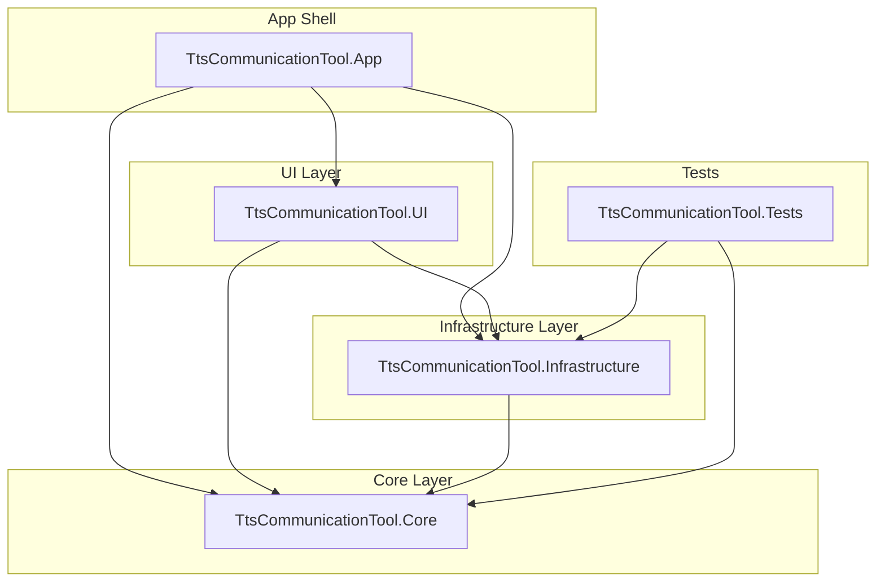
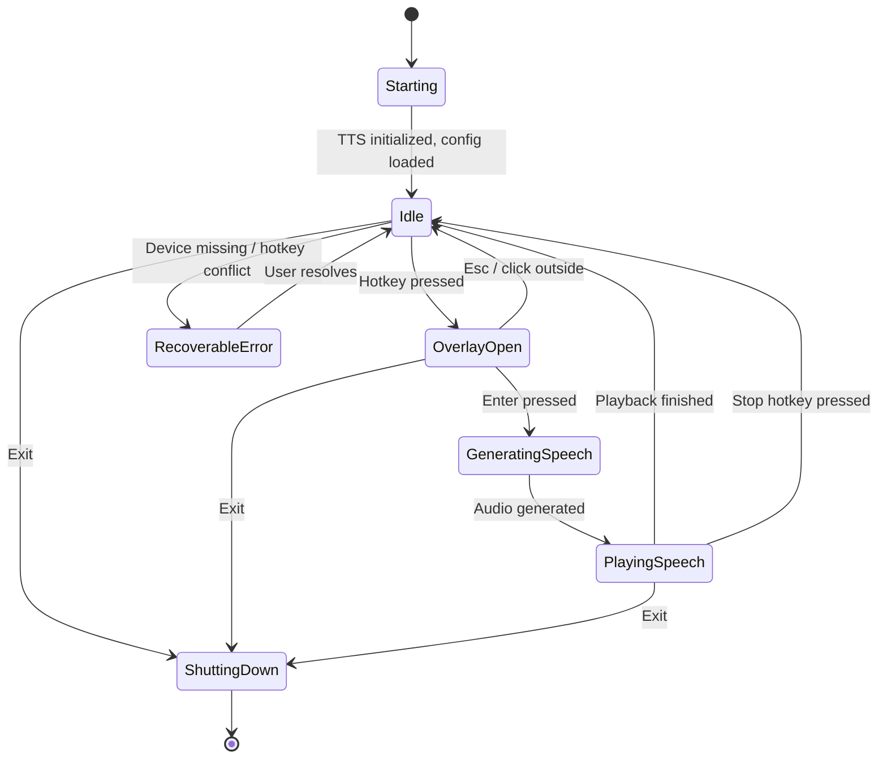

# Architecture

## Layered MVVM Architecture

The application follows a clean layered MVVM (Model-View-ViewModel) architecture with four projects:



### Layer Responsibilities

| Layer | Project | Responsibility |
|-------|---------|---------------|
| **App Shell** | `TtsCommunicationTool.App` | Bootstrap, DI registration, tray icon, hotkey host window, overlay coordinator, splash screen, single-instance enforcement |
| **UI Layer** | `TtsCommunicationTool.UI` | WPF Views (XAML), ViewModels, commands, converters, notification service |
| **Core Layer** | `TtsCommunicationTool.Core` | Models, interfaces, validation, state management, utility classes. No WPF dependencies. |
| **Infrastructure** | `TtsCommunicationTool.Infrastructure` | Service implementations: config, audio, TTS, hotkeys, logging, phrases, themes, text replacement, transcript, security |
| **Tests** | `TtsCommunicationTool.Tests` | Unit and integration tests (xUnit + Moq) |

## Application State Machine



## Dependency Injection

All services are registered in `ServiceRegistration.Configure()` using `Microsoft.Extensions.DependencyInjection`:

### Singleton Services

| Service | Interface | Implementation |
|---------|-----------|---------------|
| Logging | `ILoggingService` | `FileLoggingService` |
| Config | `IConfigService` | `JsonConfigService` |
| Audio Devices | `IAudioDeviceService` | `WasapiAudioDeviceService` |
| Audio Router | `IAudioRouterService` | `DualOutputAudioRouter` |
| TTS Router | `ITtsService` | `TtsRouter` (wraps Kokoro + ElevenLabs) |
| Kokoro TTS | — | `KokoroTtsService` |
| ElevenLabs TTS | — | `ElevenLabsTtsService` |
| Phrases | `IPhraseService` | `PhraseService` |
| Phrase Cache | `IPhraseCacheService` | `PhraseCacheService` |
| Notifications | `INotificationService` | `WpfNotificationService` |
| Text Replacements | `ITextReplacementService` | `TextReplacementService` |
| Transcript | `ITranscriptService` | `TranscriptService` |
| Themes | `IThemeService` | `ThemeService` |
| Color Picker | `IColorPickerService` | `WinFormsColorPickerService` |
| State | — | `AppRuntimeState`, `OverlayState`, `PlaybackState`, `RecentMessagesState` |
| Tray | — | `TrayIconManager` |
| Hotkey Host | `IHotkeyHost` | `HotkeyHostWindow` |
| Overlay | `IOverlayCoordinator` | `OverlayCoordinator` |

### Transient ViewModels

| ViewModel | Used By |
|-----------|---------|
| `OverlayViewModel` | Overlay window |
| `SettingsViewModel` | Settings window |
| `GeneralSettingsViewModel` | General tab |
| `HotkeySettingsViewModel` | Hotkeys tab |
| `AudioSettingsViewModel` | Audio tab |
| `VoiceSettingsViewModel` | Voice tab |
| `AppearanceSettingsViewModel` | Appearance tab |
| `ThemeSettingsViewModel` | Theme tab |
| `PhraseListViewModel` | Phrases tab |
| `PhraseEditorViewModel` | Phrase Editor window |
| `TextReplacementSettingsViewModel` | Replacements tab |

## Key Design Patterns

### Service Interfaces
All infrastructure services are defined as interfaces in Core and implemented in Infrastructure. This enables:
- Unit testing with mocks
- Clean separation of concerns
- Easy replacement of implementations

### State Singletons
Application state is managed through singleton state objects that implement `INotifyPropertyChanged`:
- `AppRuntimeState` — global app state (TTS ready, playing, overlay visible)
- `OverlayState` — overlay-specific state (current text, sending)
- `PlaybackState` — playback tracking (duration, timing)
- `RecentMessagesState` — thread-safe ring buffer of recent messages

### Async Relay Commands
All commands use `AsyncRelayCommand` for async operations and `RelayCommand` for synchronous operations. Both implement `ICommand` and support `CanExecute` state.

### Late Binding
The `PhraseService` uses late binding for the cache service to avoid circular DI:
```csharp
public void SetCacheService(IPhraseCacheService phraseCache) => _phraseCache = phraseCache;
```
This is called from `App.xaml.cs` after TTS initialization.
