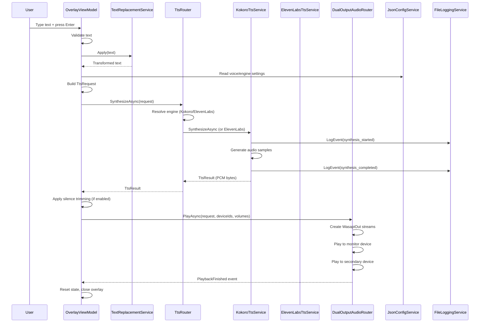
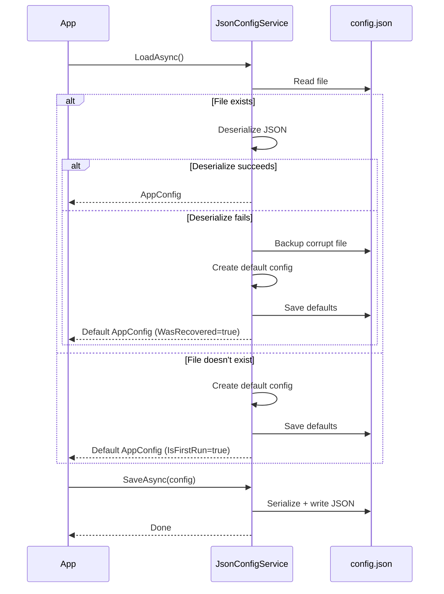
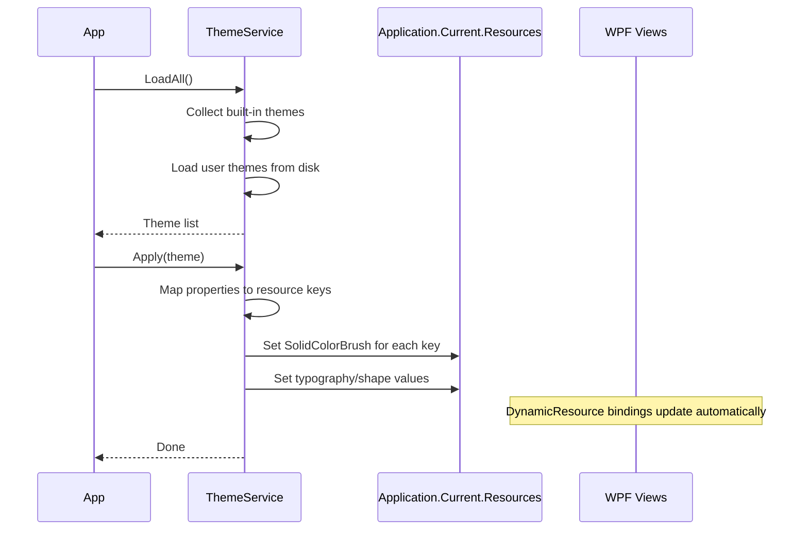
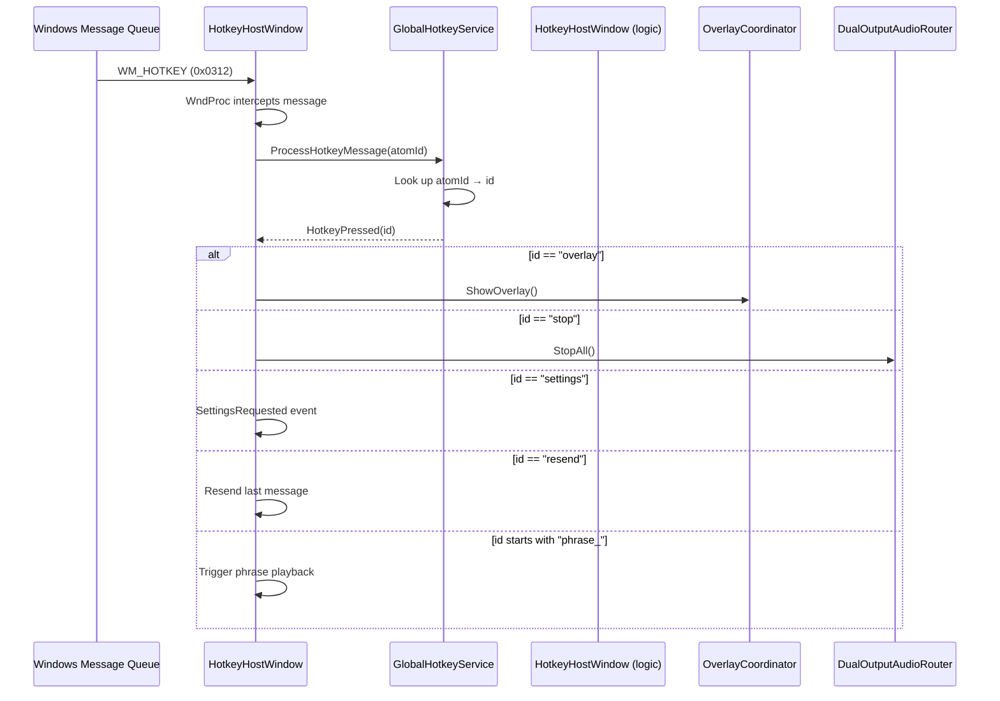

# Data Flow

## Speech Pipeline Data Flow

```mermaid
sequenceDiagram
    participant User
    participant OverlayVM as OverlayViewModel
    participant TextReplace as TextReplacementService
    participant TtsRouter
    participant Kokoro as KokoroTtsService
    participant ElevenLabs as ElevenLabsTtsService
    participant AudioRouter as DualOutputAudioRouter
    participant Config as JsonConfigService
    participant Log as FileLoggingService

    User->>OverlayVM: Type text + press Enter
    OverlayVM->>OverlayVM: Validate text
    OverlayVM->>TextReplace: Apply(text)
    TextReplace-->>OverlayVM: Transformed text
    OverlayVM->>Config: Read voice/engine settings
    OverlayVM->>OverlayVM: Build TtsRequest
    OverlayVM->>TtsRouter: SynthesizeAsync(request)
    TtsRouter->>TtsRouter: Resolve engine (Kokoro/ElevenLabs)
    TtsRouter->>Kokoro: SynthesizeAsync (or ElevenLabs)
    Kokoro->>Log: LogEvent(synthesis_started)
    Kokoro->>Kokoro: Generate audio samples
    Kokoro->>Log: LogEvent(synthesis_completed)
    Kokoro-->>TtsRouter: TtsResult (PCM bytes)
    TtsRouter-->>OverlayVM: TtsResult
    OverlayVM->>OverlayVM: Apply silence trimming (if enabled)
    OverlayVM->>AudioRouter: PlayAsync(request, deviceIds, volumes)
    AudioRouter->>AudioRouter: Create WasapiOut streams
    AudioRouter->>AudioRouter: Play to monitor device
    AudioRouter->>AudioRouter: Play to secondary device
    AudioRouter-->>OverlayVM: PlaybackFinished event
    OverlayVM->>OverlayVM: Reset state, close overlay
```

## Config Save/Load Flow

```mermaid
sequenceDiagram
    participant App
    participant Config as JsonConfigService
    participant File as config.json

    App->>Config: LoadAsync()
    Config->>File: Read file
    alt File exists
        Config->>Config: Deserialize JSON
        alt Deserialize succeeds
            Config-->>App: AppConfig
        else Deserialize fails
            Config->>File: Backup corrupt file
            Config->>Config: Create default config
            Config->>File: Save defaults
            Config-->>App: Default AppConfig (WasRecovered=true)
        end
    else File doesn't exist
        Config->>Config: Create default config
        Config->>File: Save defaults
        Config-->>App: Default AppConfig (IsFirstRun=true)
    end

    App->>Config: SaveAsync(config)
    Config->>File: Serialize + write JSON
    Config-->>App: Done
```

## Theme Application Flow

```mermaid
sequenceDiagram
    participant App
    participant ThemeService
    participant Resources as Application.Current.Resources
    participant Views as WPF Views

    App->>ThemeService: LoadAll()
    ThemeService->>ThemeService: Collect built-in themes
    ThemeService->>ThemeService: Load user themes from disk
    ThemeService-->>App: Theme list

    App->>ThemeService: Apply(theme)
    ThemeService->>ThemeService: Map properties to resource keys
    ThemeService->>Resources: Set SolidColorBrush for each key
    ThemeService->>Resources: Set typography/shape values
    Note over Views: DynamicResource bindings update automatically
    ThemeService-->>App: Done
```

## Hotkey Message Flow

```mermaid
sequenceDiagram
    participant Win32 as Windows Message Queue
    participant HWND as HotkeyHostWindow
    participant HotkeySvc as GlobalHotkeyService
    participant Host as HotkeyHostWindow (logic)
    participant Overlay as OverlayCoordinator
    participant Audio as DualOutputAudioRouter

    Win32->>HWND: WM_HOTKEY (0x0312)
    HWND->>HWND: WndProc intercepts message
    HWND->>HotkeySvc: ProcessHotkeyMessage(atomId)
    HotkeySvc->>HotkeySvc: Look up atomId → id
    HotkeySvc-->>HWND: HotkeyPressed(id)

    alt id == "overlay"
        HWND->>Overlay: ShowOverlay()
    else id == "stop"
        HWND->>Audio: StopAll()
    else id == "settings"
        HWND->>HWND: SettingsRequested event
    else id == "resend"
        HWND->>HWND: Resend last message
    else id starts with "phrase_"
        HWND->>HWND: Trigger phrase playback
    end
```
