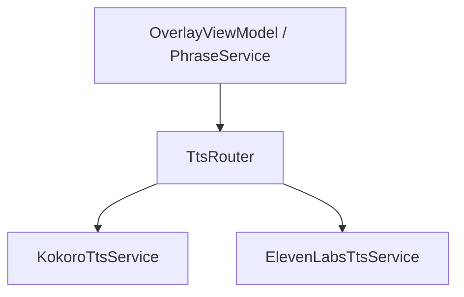

# TTS Engine Integration

## Architecture

The TTS system uses a **router pattern** to support multiple engines:



The `TtsRouter` implements `ITtsService` and delegates to the appropriate engine based on:
- The global `VoiceSettings.Engine` setting
- Per-request `EngineOverride` (used by phrases)

## ITtsService Interface

```csharp
public interface ITtsService : IAsyncDisposable
{
    Task InitializeAsync(CancellationToken ct = default);
    Task<TtsResult> SynthesizeAsync(TtsRequest request, CancellationToken ct = default);
    IReadOnlyList<VoiceInfo> GetAvailableVoices();
    bool IsInitialized { get; }
}
```

## KokoroTtsService

### Initialization
- Calls `KokoroTTS.LoadModel()` to download/load the ONNX model (~320MB)
- Calls `KokoroVoiceManager.LoadVoicesFromPath()` to discover voice files
- Both run on the thread pool to avoid blocking the UI

### Synthesis
1. Resolves the voice ID (falls back to `af_heart` if configured voice not found)
2. Tokenizes and segments text for faster first-response
3. Generates float audio samples
4. Converts to 16-bit PCM at 24000 Hz

### Voice Discovery
Voices are loaded from Kokoro's voice file directory. The app calls `KokoroVoiceManager.Voices` to enumerate available voices.

## ElevenLabsTtsService

### Initialization
- No local initialization needed
- `IsInitialized` returns true if an encrypted API key is present

### Synthesis
1. Decrypts the API key from config
2. Sends a POST request to `https://api.elevenlabs.io/v1/text-to-speech/{voiceId}`
3. Receives MP3 audio response
4. Decodes MP3 to 16-bit PCM at 44100 Hz using NAudio

### Error Handling
- 429 (rate limit): logged as warning, user-friendly message
- 404: includes the voice ID in the error message
- Other errors: parsed from ElevenLabs JSON error body

### Voice Fetching
Voices are fetched from the ElevenLabs API and cached in memory. Custom voices (user-cloned/AI-generated) are marked with `IsCustomVoice = true`.

## TtsRouter

```csharp
public sealed class TtsRouter : ITtsService
{
    private ITtsService Active =>
        _config.CurrentConfig.VoiceSettings.Engine == VoiceEngine.ElevenLabs
            ? _elevenLabs
            : _kokoro;

    private ITtsService Resolve(TtsRequest request) =>
        request.EngineOverride switch
        {
            VoiceEngine.ElevenLabs => _elevenLabs,
            VoiceEngine.Kokoro     => _kokoro,
            _                      => Active
        };
}
```

## Adding a New Engine

To add a new TTS engine:

1. Add a new value to the `VoiceEngine` enum in Core
2. Create a new service class implementing `ITtsService` in Infrastructure
3. Register it in `ServiceRegistration.Configure()`
4. Add routing logic to `TtsRouter.Resolve()`
5. Add UI in `VoiceSettingsViewModel` for engine selection
6. Update `PhraseEditorViewModel` to support the new engine for per-phrase overrides

## TtsRequest Model

```csharp
public sealed class TtsRequest
{
    public required string Text { get; init; }
    public string VoiceId { get; init; } = string.Empty;
    public string? RequestId { get; init; }
    public float Pitch { get; init; } = 1.0f;
    public VoiceEngine? EngineOverride { get; init; }
}
```

## TtsResult Model

```csharp
public sealed class TtsResult
{
    public bool Success { get; init; }
    public byte[]? AudioData { get; init; }
    public int SampleRate { get; init; }
    public int Channels { get; init; } = 1;
    public int BitsPerSample { get; init; } = 16;
    public string? ErrorMessage { get; init; }
}
```
