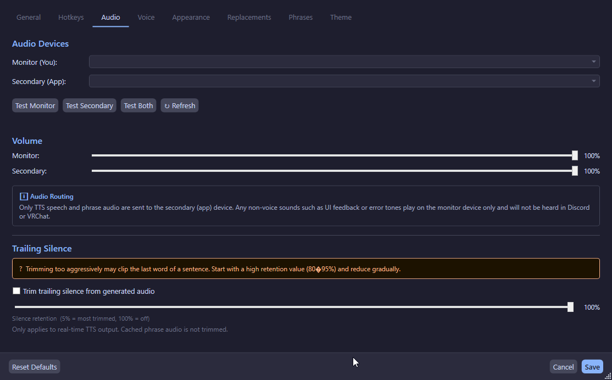

# Installation

## System Requirements

| Requirement | Detail |
|-------------|--------|
| Operating System | Windows 10 or 11 (x64) |
| Runtime | .NET 10 runtime (bundled in release builds) |
| Virtual Audio Cable | [VB-Cable](https://vb-audio.com/Cable/) or equivalent (installed separately) |
| Disk Space | ~350 MB (includes Kokoro TTS model) |
| RAM | ~200 MB at idle |

!!!warning
This application is **Windows-only**. It uses WPF, NAudio (WASAPI), and Win32 P/Invoke for global hotkeys — none of which work on Linux or macOS.
!!!

## Download

### Pre-built Release

1. Go to the [Releases page](https://github.com/FinickySpider/TtsCommunicationTool/releases)
2. Download the latest `TtsCommunicationTool.App.exe`
3. Place it anywhere on your system (no installer required)

## Prerequisites

### Install VB-Cable

The app requires a virtual audio cable to route TTS audio into voice applications.

1. Download [VB-Cable](https://vb-audio.com/Cable/) (free)
2. Run the installer
3. Restart your PC if prompted
4. Verify "CABLE Input" and "CABLE Output" appear in your Windows sound devices

!!!tip Alternative Virtual Cables
Other virtual audio cables work too, including:
- [VB-Cable](https://vb-audio.com/Cable/) (free)
- [VB-Cable A+B](https://vb-audio.com/VirtualCables/) (paid, multiple cables)
- [Voicemeeter](https://vb-audio.com/Voicemeeter/) (advanced virtual mixer)
- [Virtual Audio Cable](https://vac.muzychenko.net/) (paid alternative)
!!!

### Configure Voice Applications

In Discord, VRChat, or any voice app:

1. Open **Audio / Voice Settings**
2. Set **Microphone Input** to **CABLE Output (VB-Audio Virtual Cable)**
3. Keep **Speaker Output** set to your normal headphones/speakers

## First Run

When you launch the app for the first time:

1. The app appears in the system tray (near the clock)
2. The **Settings window opens automatically**
3. Open the **Audio** tab:
   - Select your **Monitor Output** device (headphones/speakers)
   - Select your **Secondary Output** device (CABLE Input)
   - Testing each output
   - Confirming your overlay hotkey (default: Ctrl+Shift+Space)
4. Save your settings

## Updating

To update to a new version:

1. Download the new executable
2. Close the running app (right-click tray icon → Exit)
3. Replace the old executable with the new one
4. Launch the new executable

Your settings and phrases are stored in `%AppData%\TtsCommunicationTool\` and are preserved across updates.
