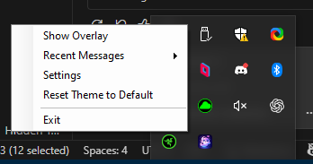
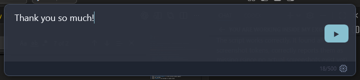

# Quickstart

Get from a fresh install to speaking your first message in under two minutes.

## Step 1: Launch the App

Run `TtsCommunicationTool.App.exe`. The app starts in the system tray.

## Step 2: Configure Audio (First Run Only)

On first launch, the Settings window opens automatically:

1. **Monitor Output** — Select your headphones or speakers
2. **Secondary Output** — Select **CABLE Input (VB-Audio Virtual Cable)**
3. Click **Test Monitor** to hear a test tone on your headphones
4. Click **Test Secondary** to route a test tone through the virtual cable
5. Click **Save**

!!!tip
If the Settings window doesn't open, right-click the tray icon and select **Settings**.
!!!

## Step 3: Set Up Your Voice App

In Discord, VRChat, or your voice app:

1. Open audio settings
2. Set **Microphone** to **CABLE Output (VB-Audio Virtual Cable)**
3. Keep **Speaker** as your normal output device

## Step 4: Speak!

1. Press **Ctrl+Shift+Space** — a dark overlay window appears
2. Type your message
3. Press **Enter** — the message is spoken aloud

## Step 5: Stop Playback (If Needed)

Press **Ctrl+Shift+Backspace** to immediately stop any speech that's playing.

## What's Next?

- [Explore all features](user-guide/features.md)
- [Save quick phrases](user-guide/phrase-system.md)
- [Customize hotkeys](user-guide/settings.md#hotkeys)
- [Change voices](user-guide/voices.md)
