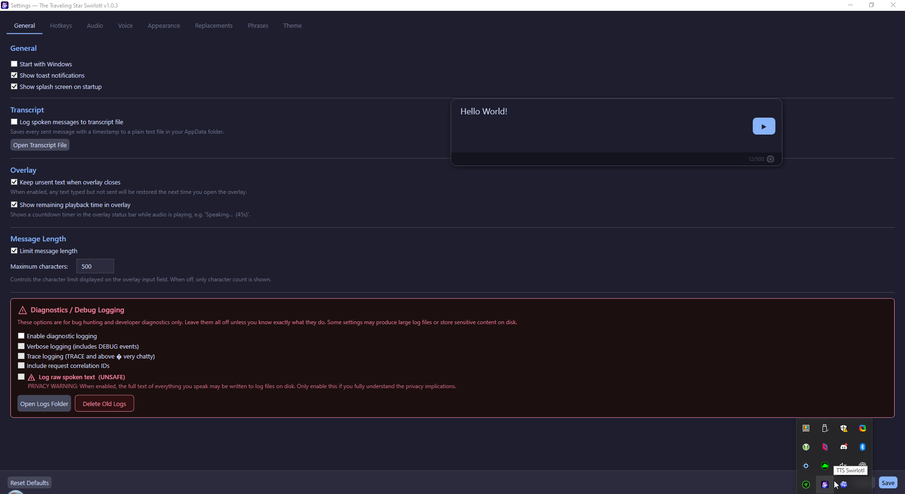

# VoxBridge AKA (The Traveling Star Swirlotl)

> A lightweight Windows desktop text-to-speech application for fast, reliable voice communication in Discord, VRChat, and other voice-enabled applications.

## What is it?

TTS Communication Tool is a **communication prosthetic** for mute users who need instant, reliable speech in live voice conversations. It lives unobtrusively in the system tray and provides a hotkey-driven overlay for typing messages that are spoken aloud through both your headphones and a virtual audio cable (used as microphone input by Discord, VRChat, etc.).

## Start Here

- **[Getting Started](getting-started/installation.md)** — Installation, requirements, and first-run setup
- **[Quickstart](getting-started/quickstart.md)** — Get speaking in 2 minutes
- **[User Guide](user-guide/overview.md)** — Complete feature documentation for end users

## Quick Facts

| Aspect | Detail |
|--------|--------|
| Platform | Windows 10/11 (x64 only) |
| Language | C# / .NET 10 |
| UI Framework | WPF with MVVM |
| TTS Engine | Kokoro (offline) + optional ElevenLabs |
| Audio | NAudio (WASAPI dual-output) |
| Config | JSON at `%AppData%\TtsCommunicationTool\config.json` |
| License | Proprietary |

## Quick Start

1. Install [VB-Cable](https://vb-audio.com/Cable/) (or any virtual audio cable)
2. Launch the app — it appears in the system tray
3. On first run, the Settings window opens automatically
4. Select your **Monitor Output** (headphones/speakers) and **Secondary Output** (CABLE Input)
5. Press **Ctrl+Shift+Space** to open the overlay, type a message, press **Enter**

## Navigation

- **[Getting Started](getting-started/installation.md)** — Installation, requirements, and first-run setup
- **[User Guide](user-guide/overview.md)** — Complete feature documentation for end users
- **[Troubleshooting](troubleshooting/common-issues.md)** — Common problems and solutions
