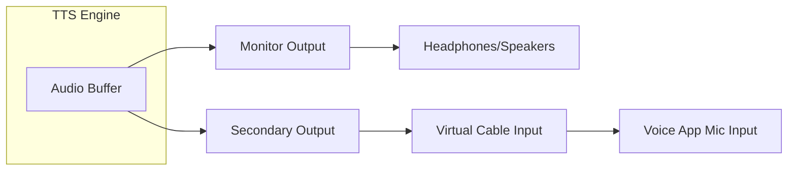

# Audio Output

## Dual-Output Architecture

The app plays audio simultaneously to two independent output devices:

### Monitor Output
The primary output device — typically your headphones or speakers. This is where you hear the speech.

### Secondary Output
The virtual audio cable input. Voice applications (Discord, VRChat) use this as their microphone input.

## Volume Controls

Independent volume sliders for each output:

- **Monitor Volume**: 0–100% (default: 100%)
- **Secondary Volume**: 0–100% (default: 100%)

Volumes are applied as float multipliers (0.0–1.0) to the NAudio `WasapiOut` stream.

## Device Selection

In **Settings → Audio**:

1. **Monitor Output** dropdown — lists all active WASAPI render devices
2. **Secondary Output** dropdown — lists all active WASAPI render devices
3. **Refresh** button — re-enumerates devices (useful after plugging/unplugging)

!!!warning Device IDs
Device IDs are stored as WASAPI device identifiers. If a device is disconnected or drivers change, the saved ID may become invalid. The app will show a warning and you'll need to re-select the device.
!!!

## Test Buttons

Three test buttons help verify your audio setup:

| Button | What it does |
|--------|-------------|
| **Test Monitor** | Plays a short test tone to the monitor output only |
| **Test Secondary** | Plays a short test tone to the secondary output only |
| **Test Both** | Plays a short test tone to both outputs simultaneously |

## Trailing Silence Trimming

When enabled, the app automatically removes trailing silence from generated TTS audio:

- **Trim Trailing Silence**: Enable/disable the feature
- **Silence Retention**: What percentage of trailing silence to keep (5–100%)
  - 5% = almost all silence removed (fastest turnaround)
  - 100% = no trimming (default)

### How It Works

1. After TTS synthesis, the raw 16-bit PCM data is scanned backwards from the end
2. Frames where all samples are below the silence threshold (~0.5% of max amplitude) are identified
3. The specified fraction of trailing silence is retained
4. The trimmed audio is passed to the audio router

!!!tip
Enabling silence trimming can significantly reduce the gap between pressing Enter and hearing speech, especially with voices that produce long trailing silences.
!!!

## Audio Format

| Property | Value |
|----------|-------|
| Kokoro sample rate | 24000 Hz |
| ElevenLabs sample rate | 44100 Hz (decoded from MP3) |
| Bit depth | 16-bit PCM |
| Channels | Mono (1) |
| Playback API | NAudio WasapiOut |

## Playback State

The `PlaybackState` singleton tracks:
- `IsPlaying` — whether audio is currently playing
- `CurrentText` — the text being spoken
- `PlaybackDurationSeconds` — total audio duration
- `PlaybackStartedUtc` — when playback began

This state is shared between the overlay and phrase playback, ensuring the playback timer and status display are consistent.
