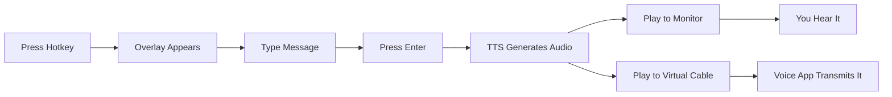

# User Guide Overview

The TTS Communication Tool is designed around a simple, fast workflow. This guide covers every user-facing feature.

## Core Workflow

## Sections

- **[Features](features.md)** — Complete list of all features
- **[TTS Workflow](tts-workflow.md)** — Detailed walkthrough of the speech pipeline
- **[Voices](voices.md)** — Kokoro offline voices and ElevenLabs integration
- **[Audio Output](audio-output.md)** — Dual-output routing, volume, and silence trimming
- **[Settings](settings.md)** — All settings tabs explained
- **[Shortcuts](shortcuts.md)** — All keyboard shortcuts and hotkeys
- **[Phrase System](phrase-system.md)** — Saved phrases, categories, favorites, and import/export
- **[Text Replacements](text-replacements.md)** — Automatic text substitution rules
- **[Themes](themes.md)** — Visual customization and theme management
- **[Importing & Exporting](importing-exporting.md)** — Data portability features
