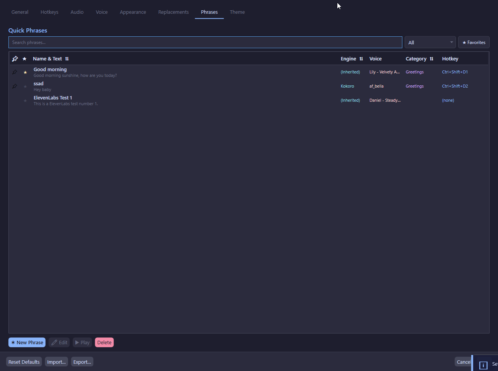
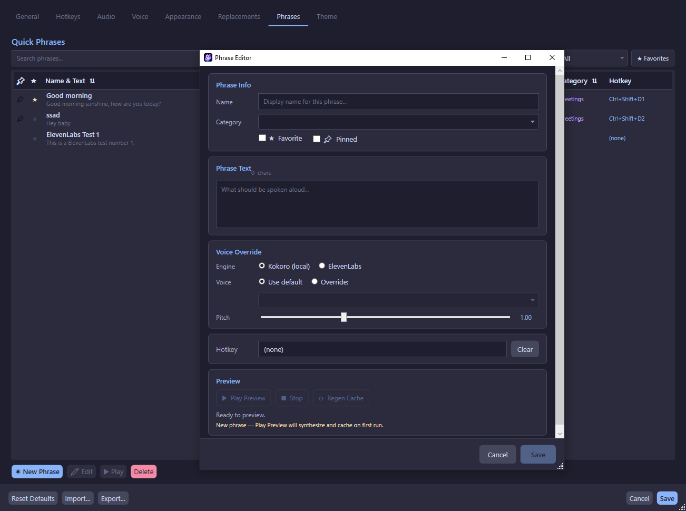

# Phrase System

The phrase system lets you save frequently-used messages and trigger them instantly.

## Phrase Manager

Open the Phrase Manager from:
- **Settings → Phrases** tab
- Tray icon → **Open Phrase Manager**



### Phrase Fields

| Field | Description |
|-------|-------------|
| Name | Display name (max 50 characters) |
| Text | The spoken text (max 500 characters) |
| Category | Optional grouping label |
| Hotkey | Optional global hotkey to trigger this phrase |
| Favorite | Mark for quick filtering |
| Pinned | Pin to top of the list |
| Sort Order | Numeric position in the list |

### Operations

- **Add** — Create a new phrase
- **Update** — Save changes to an existing phrase
- **Delete** — Remove a phrase (with confirmation)
- **Play** — Trigger TTS for the selected phrase immediately
- **Import** — Import phrases from a JSON file
- **Export** — Export phrases to a JSON file

### Filtering & Search

- **Search box** — Filter phrases by text or name
- **Category filter** — Show only phrases in a specific category
- **Favorites toggle** — Show only favorite phrases

## Phrase Editor

The Phrase Editor is a dedicated window for detailed phrase editing.



### Voice Override Settings

Each phrase can override the global voice configuration:

| Setting | Description |
|---------|-------------|
| Engine Override | Force Kokoro or ElevenLabs for this phrase |
| Voice Override | Use a specific voice for this phrase |
| Pitch Override | Set a per-phrase pitch (0.5–2.0) |

### Preview

- **Play Preview** — Synthesize and play the phrase with current settings
- **Regen Cache** — Regenerate the cached audio file

!!!tip Preview Caching
The preview cache stores the last synthesized audio. Changing any setting (text, engine, voice, pitch) invalidates the cache, ensuring you never hear stale audio. This also prevents unnecessary ElevenLabs API calls.
!!!

## Phrase Audio Cache

Phrases are pre-cached as WAV files on disk for instant playback:

- **Location**: `%AppData%\TtsCommunicationTool\phrase_cache\{phraseId}.wav`
- **Generated**: Automatically when a phrase is added or updated
- **Used**: On phrase playback — if cache exists, no TTS synthesis is needed
- **Invalidated**: When phrase text changes

## Import/Export

### Export Format

Phrases are exported as a JSON array:

```json
[
  {
    "id": "guid-here",
    "name": "Greeting",
    "text": "Hello everyone!",
    "category": "Social",
    "isFavorite": true,
    "isPinned": false,
    "sortOrder": 1,
    "hotkey": null,
    "overrideEngine": null,
    "useVoiceOverride": false,
    "overrideVoiceId": null,
    "overrideVoiceName": null,
    "overridePitch": null,
    "createdUtc": "2026-01-01T00:00:00Z",
    "updatedUtc": "2026-01-01T00:00:00Z"
  }
]
```

### Import Behavior

- Phrases are **added** to the existing list (not replaced)
- If a phrase name conflicts with an existing phrase, the imported name is adjusted
- Hotkeys from imported phrases are cleared to prevent conflicts
- A summary is shown: how many added, names changed, hotkeys cleared

## Recent Messages

The last 20 sent messages are tracked in memory (not persisted to disk):

- Duplicate consecutive entries are collapsed
- Cleared on app restart
- Accessible via the overlay's resend button or Resend hotkey
