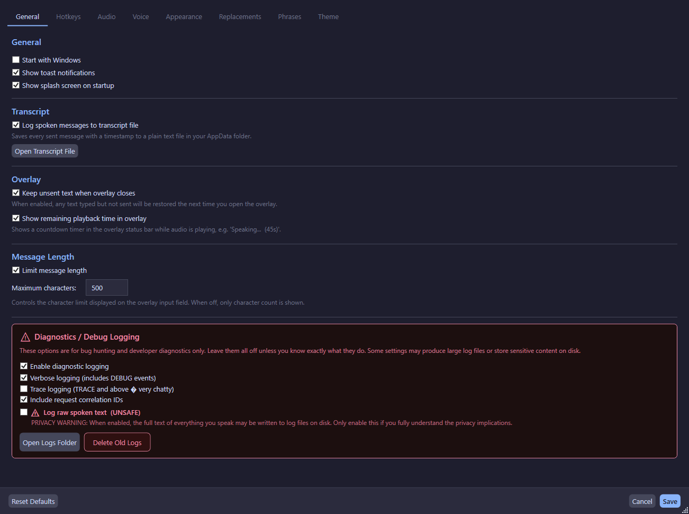

# Settings

The Settings window provides access to all configuration options. Open it by:
- Right-clicking the tray icon → **Settings**
- Pressing the Settings hotkey (if configured)

## General Tab

### General Options

| Setting | Default | Description |
|---------|---------|-------------|
| Start with Windows | Off | Launch the app automatically when you log in |
| Show notifications | On | Show toast notifications for events |
| Show splash screen | On | Show the splash screen on startup |
| Enable transcript logging | Off | Log all spoken text to `transcript.txt` |
| Keep overlay text | Off | Preserve unsent text when overlay closes |
| Enable character limit | On | Limit overlay input to max characters |
| Max overlay input length | 500 | Maximum characters when limit is enabled |
| Show playback timer | On | Show remaining time in overlay during playback |

### Diagnostic Logging

| Setting | Default | Description |
|---------|---------|-------------|
| Enable diagnostic logging | Off | Write structured JSONL session logs |
| Verbose logging | Off | Include DEBUG-level events |
| Trace logging | Off | Include TRACE-level events (very chatty) |
| Include request IDs | Off | Attach correlation IDs to TTS pipeline events |
| Log raw text | Off | **Warning**: may capture sensitive/private content |

!!!danger Log Raw Text
Enabling "Log raw text" will write the actual spoken text to log files. This can capture sensitive or private information. Only enable for debugging specific issues, and disable it afterward.
!!!

## Hotkeys Tab

Configure global hotkeys for various actions:

| Hotkey | Default | Description |
|--------|---------|-------------|
| Overlay hotkey | Ctrl+Shift+Space | Open the overlay window |
| Stop hotkey | Ctrl+Shift+Backspace | Stop current playback |
| Settings hotkey | (none) | Open the Settings window |
| Resend hotkey | (none) | Repeat the last spoken message |
| Override hotkey | Ctrl+Enter | Stop current audio and send overlay text immediately |

!!!warning Hotkey Rules
- At least one modifier (Ctrl, Alt, Shift) is required
- Win key is not supported as a modifier
- Reserved keys (LeftCtrl, RightAlt, etc.) cannot be used alone
- Duplicate hotkeys are detected and rejected
!!!

## Audio Tab

See [Audio Output](audio-output.md) for full details.

| Setting | Default | Description |
|---------|---------|-------------|
| Monitor Output | (first run) | Your headphones/speakers |
| Secondary Output | (first run) | Virtual cable input |
| Monitor Volume | 100% | Volume for monitor output |
| Secondary Volume | 100% | Volume for secondary output |
| Trim Trailing Silence | Off | Remove silence from end of audio |
| Silence Retention | 100% | How much silence to keep (5–100%) |

## Voice Tab

See [Voices](voices.md) for full details.

| Setting | Default | Description |
|---------|---------|-------------|
| TTS Engine | Kokoro | Kokoro (offline) or ElevenLabs (cloud) |
| Kokoro Voice | AF Heart | Select from available Kokoro voices |
| ElevenLabs Voice | (none) | Select from fetched ElevenLabs voices |
| Global Pitch | 1.0 | Pitch multiplier (0.5–2.0, applies live) |
| ElevenLabs API Key | (none) | Encrypted with DPAPI |

## Appearance Tab

| Setting | Default | Description |
|---------|---------|-------------|
| Overlay Width | 720 | Width of the overlay window |
| Overlay Height | 160 | Height of the overlay window |
| Overlay Opacity | 0.93 | Background opacity (0.20–0.95) |

Opacity changes are previewed **live** on the open overlay window.

## Phrases Tab

See [Phrase System](phrase-system.md) for full details.

## Theme Tab

See [Themes](themes.md) for full details.

## Replacements Tab

See [Text Replacements](text-replacements.md) for full details.

## Save Behavior

- The **Save** button persists all changes to `config.json`
- Hotkeys are re-registered after save (no restart needed)
- A save toast notification appears (debounced to prevent spam)
- The **Cancel** button reverts all unsaved changes
- The **Reset Defaults** button resets all settings to factory defaults
