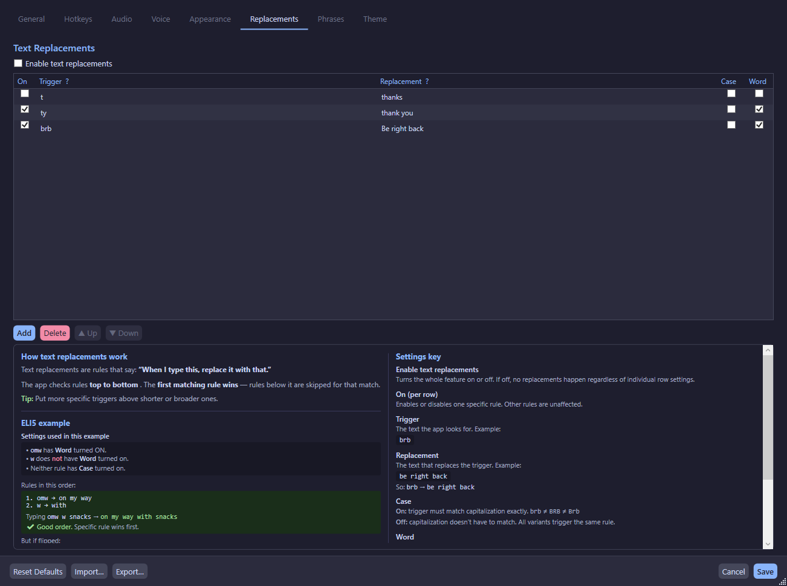

# Text Replacements

Text replacements automatically transform your input text before it's sent to the TTS engine. This is useful for expanding abbreviations, correcting common typos, or substituting words.

## How It Works

1. You type text in the overlay
2. Before TTS synthesis, the `TextReplacementService` applies all enabled rules
3. The transformed text is sent to the TTS engine
4. The original text in the overlay is unchanged

## Managing Rules

In **Settings → Replacements**:

### Rule Fields

| Field | Description |
|-------|-------------|
| Trigger Text | The text to find |
| Replacement Text | The text to replace with |
| Enabled | Toggle the rule on/off |
| Case Sensitive | Match exact case (default: off) |
| Whole Word Only | Only match whole words (default: off) |

### Operations

- **Add** — Create a new replacement rule
- **Delete** — Remove a selected rule
- **Import** — Import rules from a JSON file
- **Export** — Export rules to a JSON file

## Rule Processing

Rules are processed in a single pass:

1. All enabled rules are sorted by their internal sort order
2. Each rule finds all matches in the input text
3. Earlier rules claim their match positions first
4. Later rules skip any text that overlaps with already-claimed positions
5. The output is built by walking through all substitutions in position order

!!!tip Priority
Add important rules with lower sort order numbers so they take priority over overlapping matches from later rules.
!!!

## Examples

| Trigger | Replacement | Case Sensitive | Whole Word | Input → Output |
|---------|-------------|----------------|------------|----------------|
| `brb` | `be right back` | No | Yes | "brb" → "be right back" |
| `lol` | `laughing out loud` | No | Yes | "lol" → "laughing out loud" |
| `API` | `A-P-I` | Yes | No | "API key" → "A-P-I key" |
| `btw` | `by the way` | No | Yes | "btw, I'm here" → "by the way, I'm here" |

## Global Toggle

The entire text replacement system can be enabled or disabled with the **Enable Replacements** toggle at the top of the Replacements tab. When disabled, no rules are applied regardless of individual rule states.
