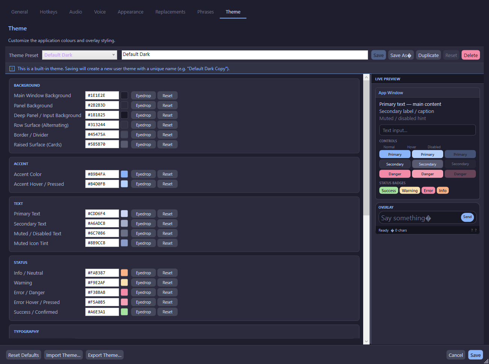

# Themes

The theme system allows complete visual customization of the application.

## Built-in Themes

| Theme | Description |
|-------|-------------|
| **Default Dark** | Catppuccin Mocha-inspired dark theme (default) |
| **Default Light** | Catppuccin Latte-inspired light theme |
| **Midnight Purple** | Dark purple-toned theme |
| **Nord** | Arctic, bluish Nord theme |

## Theme Editor

In **Settings → Theme**:



### Colour Categories

| Category | Properties |
|----------|------------|
| **Background** | Window, Panel, Deep Panel, History, Surface 0, Border, Surface 2 |
| **Accent** | Accent, Accent Hover |
| **Text** | Primary, Secondary, Muted, Muted Icon |
| **Status** | Info, Error, Error Hover, Warning, Success |
| **Overlay Only** | Overlay Background, Overlay Border, Overlay Opacity, Overlay Corner Radius |

### Typography

| Setting | Default | Description |
|---------|---------|-------------|
| UI Font Family | Segoe UI | Font for all non-overlay windows |
| Base Font Size | 13 pt | Base text size |
| Overlay Font Family | Segoe UI | Font for overlay input |
| Overlay Font Size | 18 pt | Font size for overlay input |

### Shape & Density

| Setting | Default | Description |
|---------|---------|-------------|
| Corner Radius | 6 px | Rounded corners for controls |
| Border Thickness | 1 px | Default border width |
| Control Height | 28 px | Standard control height |
| Spacing Density | Comfortable | Compact, Comfortable, or Spacious |

### Colour Editing

Each colour swatch can be edited by:
1. **Clicking the swatch** — Opens the Windows native colour picker dialog
2. **Clicking the eyedropper button** — Opens a screen colour picker to sample any pixel on screen
3. **Typing a hex value** — Directly enter `#RRGGBB` values

### WCAG 2.1 AA Contrast Checker

The theme editor includes a built-in contrast checker that evaluates colour pairs against WCAG 2.1 AA standards:

| Rating | Ratio | Indicator |
|--------|-------|-----------|
| **Good** | ≥ 4.5:1 | Green |
| **Warning** | 3.0–4.49:1 | Yellow |
| **Fail** | < 3.0:1 | Red |

The contrast ratio is calculated using the relative luminance formula from the WCAG 2.1 specification.

## Theme Management

### Preset Selection

Select any theme from the dropdown to load it into the editor. Changes are previewed live.

### Save As / Duplicate

- **Save As** — Save the current theme as a new user theme
- **Duplicate** — Create a copy of the current theme and switch to it immediately

### Delete

User-created themes can be deleted (with confirmation). Built-in themes cannot be deleted.

### Import / Export

- **Export** — Save a theme as a `.ttstheme` JSON file
- **Import** — Load a theme from a `.ttstheme` file (validates required fields)

### Reset to Default

Right-click the tray icon → **Reset Theme to Default** to immediately revert to the Default Dark theme.

## User Theme Storage

User themes are stored as individual `.ttstheme` JSON files:

```
%AppData%\TtsCommunicationTool\themes\*.ttstheme
```

Built-in themes are defined in code (`ThemeDefaults` class) and always appear before user themes in the preset list.

## Theme Application

Themes are applied via `IThemeService.Apply()` which:
1. Maps each `ThemeSettings` property to a WPF `DynamicResource` key
2. Creates `SolidColorBrush` objects from hex colour strings
3. Sets each brush as `Application.Current.Resources[resourceKey]`
4. All XAML elements using `{DynamicResource ...}` update automatically
