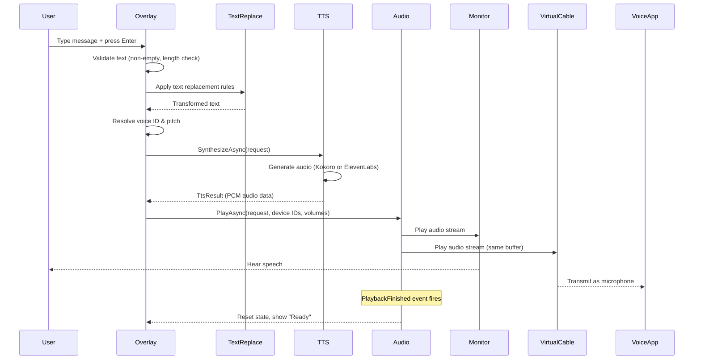

# TTS Workflow

This page explains the complete text-to-speech pipeline from keypress to audio output.

## The Speech Pipeline

## Step-by-Step

### 1. Text Input
The user types text in the overlay window. The overlay validates:
- Text is not empty or whitespace-only
- Text does not exceed the character limit (if enabled)

### 2. Text Replacement
If text replacements are enabled, the input text passes through the `TextReplacementService`. Rules are applied in sort order. Earlier rules take priority over overlapping later rules.

### 3. Voice Resolution
The system determines which voice to use:
- For **standard overlay input**: uses the globally configured voice and pitch
- For **phrases**: uses per-phrase overrides if set, otherwise falls back to global settings

### 4. TTS Synthesis
The `TtsRouter` selects the appropriate engine:
- **Kokoro** (default): Offline synthesis via KokoroSharp. The model (~320MB) auto-downloads on first use.
- **ElevenLabs** (optional): Cloud API synthesis. Requires an API key and internet connection.

### 5. Audio Playback
The `DualOutputAudioRouter` receives the PCM audio data and:
1. Creates a `WaveFormat` from the audio metadata (sample rate, bit depth, channels)
2. Fans the same audio buffer to two NAudio `WasapiOut` streams
3. Applies per-output volume levels
4. Starts both streams near-simultaneously

### 6. Completion
When playback finishes naturally:
- The `PlaybackFinished` event fires
- The overlay state resets to "Ready"
- The overlay closes (if configured)

If the stop hotkey is pressed during playback:
- `StopAll()` cancels the playback cancellation token
- Both NAudio streams are stopped and disposed
- The `PlaybackFinished` event is suppressed (to distinguish forced stop from natural completion)

## Text Replacement Rules

Text replacements are applied in a single pass:

1. All enabled rules are collected and sorted by `SortOrder`
2. Each rule finds matches using regex (case-insensitive by default, whole-word optional)
3. Earlier rules claim their match spans first
4. Later rules skip any text that overlaps with already-claimed spans
5. The output is built by walking through substitutions in position order

## Pitch Application

- **Global pitch** (0.5–2.0) is applied to all standard overlay TTS
- **Phrases** always use pitch 1.0 (neutral) unless a per-phrase override is set
- Pitch is passed as a `TtsRequest.Pitch` value and handled by the TTS engine

## Trailing Silence Trimming

If enabled in audio settings:
1. After TTS synthesis, the raw PCM data is scanned backwards from the end
2. Frames where all samples are below the silence threshold (~0.5% amplitude) are identified
3. A configurable fraction of the trailing silence is retained (0–100%)
4. The trimmed audio is passed to the audio router for playback
