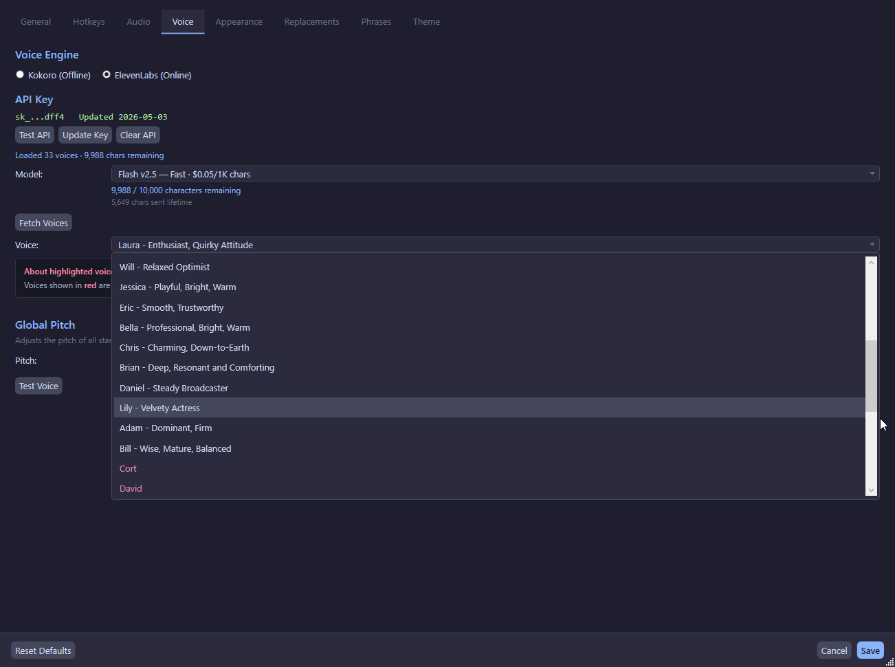

# Voices

The app supports two TTS engines: **Kokoro** (offline, default) and **ElevenLabs** (cloud, optional).

## Kokoro Voices

Kokoro is the default TTS engine. It runs entirely offline — no internet connection required.

### Voice List

Kokoro provides a variety of voices loaded from bundled voice model files. The default voice is **AF Heart** (`af_heart`).

| Voice ID | Display Name | Notes |
|----------|-------------|-------|
| `af_heart` | AF Heart | Default voice, warm female |
| (varies) | (varies) | Additional voices loaded from Kokoro voice files |

!!!info
The exact list of available Kokoro voices depends on the voice files present in the KokoroSharp installation. The app calls `KokoroVoiceManager.LoadVoicesFromPath()` during initialization to discover available voices.
!!!

### Voice Fallback

If the configured voice ID is not found, the app falls back to `af_heart`. If even the default voice is missing, synthesis fails with a clear error message.

## ElevenLabs Voices (Optional)

ElevenLabs provides high-quality cloud-based AI voices. This is an optional integration that requires:

1. An [ElevenLabs account](https://elevenlabs.io/)
2. An API key (stored encrypted with DPAPI)
3. An internet connection for synthesis

### Setup

1. Go to **Settings → Voice**
2. Switch the engine to **ElevenLabs**
3. Click **Enter API Key** and paste your key
4. The app fetches your available voices and subscription info
5. Select a voice from the list

### API Key Security

- The API key is encrypted using Windows DPAPI (`DataProtectionScope.CurrentUser`)
- Only the last 4 characters are stored in plain text (for display purposes)
- The encrypted key is stored in `config.json` as `elevenLabs.encryptedApiKey`
- Legacy plain-text keys are migrated to encrypted storage on first load

### Subscription Info

After entering a valid API key, the app displays:
- Characters used this billing period
- Total character quota
- Cumulative characters used across all sessions

### Custom Voices

ElevenLabs voices marked as `IsCustomVoice` (user-cloned or AI-generated) are highlighted in red in the UI. These require a Creator or higher ElevenLabs subscription.

### Model Selection

The default ElevenLabs model is `eleven_multilingual_v2`. This can be changed in the Voice settings tab.

## Global Pitch Control

A global pitch multiplier affects all standard TTS output:

| Setting | Effect |
|---------|--------|
| 0.5 | Half pitch (deeper) |
| 1.0 | Normal pitch (default) |
| 2.0 | Double pitch (higher) |

- Changes apply **live** — no save required
- Clamped to [0.5, 2.0]
- **Phrases** always use pitch 1.0 unless a per-phrase override is set

## Per-Phrase Voice Override

Each phrase can override the global voice settings:

- **Engine override**: Use Kokoro or ElevenLabs for a specific phrase
- **Voice override**: Use a specific voice for a specific phrase
- **Pitch override**: Set a per-phrase pitch multiplier

These are configured in the **Phrase Editor** window.
